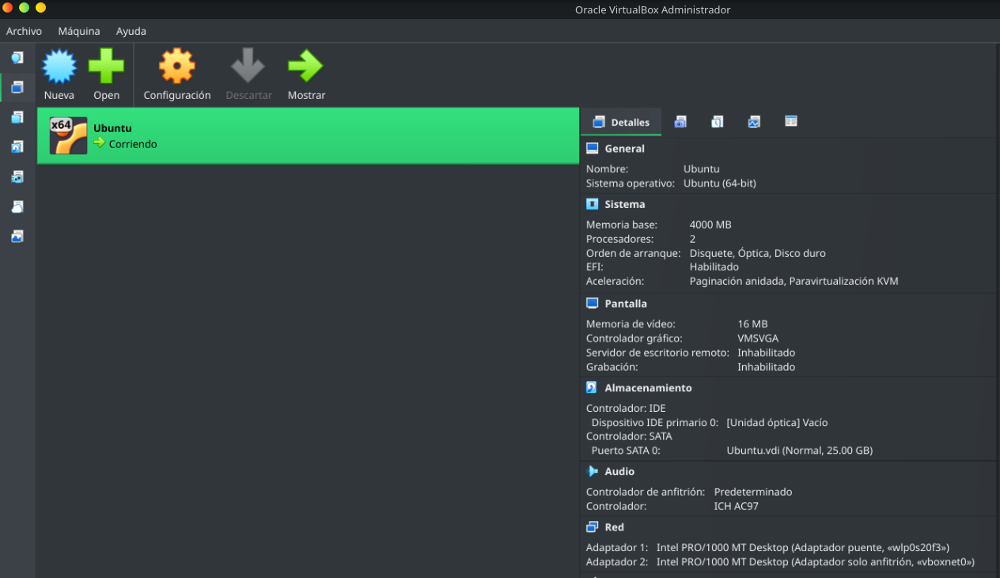

Descripción.

Se realiza ejercicio para escaneo de puertos con Nmap y captura de paquetes con Wireshark.

## Herramientas:

* Virtualbox v7.2.20
* Nmap v7.95
* Wireshark v4.4.18

## Desarrollo:

1.- Creamos nuestra máquina virtual el sistema operativo será Ubuntu-26.04.1 Desktop-amd64.iso:

