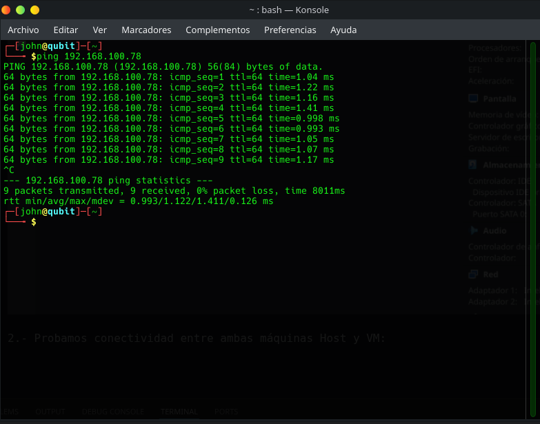
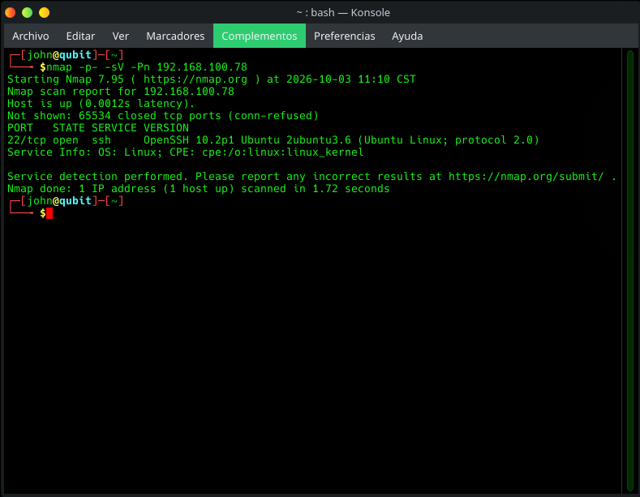
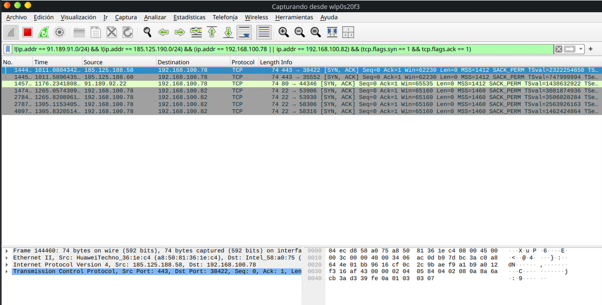

Descripción.

Se realiza ejercicio para escaneo de puertos con Nmap y captura de paquetes con Wireshark.

## Herramientas:

* Virtualbox v7.2.20
* Nmap v7.95
* Wireshark v4.4.18

## Desarrollo:

1.- Creamos nuestra máquina virtual el sistema operativo será Ubuntu-26.04.1 Desktop-amd64.iso, se configuran dos adaptadores de red un adaptador puente y otro solo anfitrión (red privada):

2.- Probamos conectividad entre ambas máquinas Host y VM:

3.- Hacemos el escaneo con Nmap usamos el parámetro -p- para escanear todos los puertos posiboles y -sV para la detección de versiones de servicios, "nmap -p- -sV 192.100.78", Nota: Usamos el parámetro -Pn para evitar bloqueos o filtrados del protocolo ICMP:

4.- Capturamos con Wireshark el tráfico, podemos ver respuestas del servicio ssh en el puerto 22:

